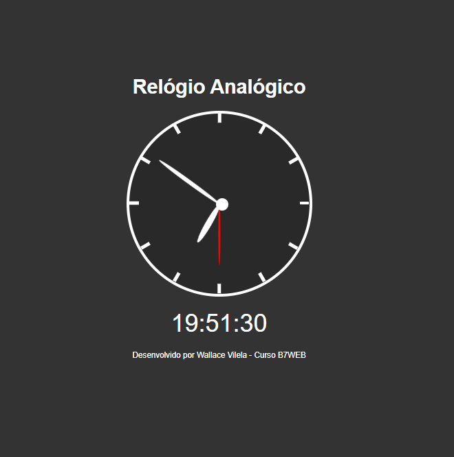

# RelogioJS

Este projeto é um desafio do curso de Javascript da b7web, com ele pude praticar as minha habilidades de manipulação de DOM com o javascript. O principal desafio foi controlar os ponteiros do relógio analógico com  a propriedade transform do CSS3.

##Layout 

##Licença

 Este projeto esta sob licença MIT 
